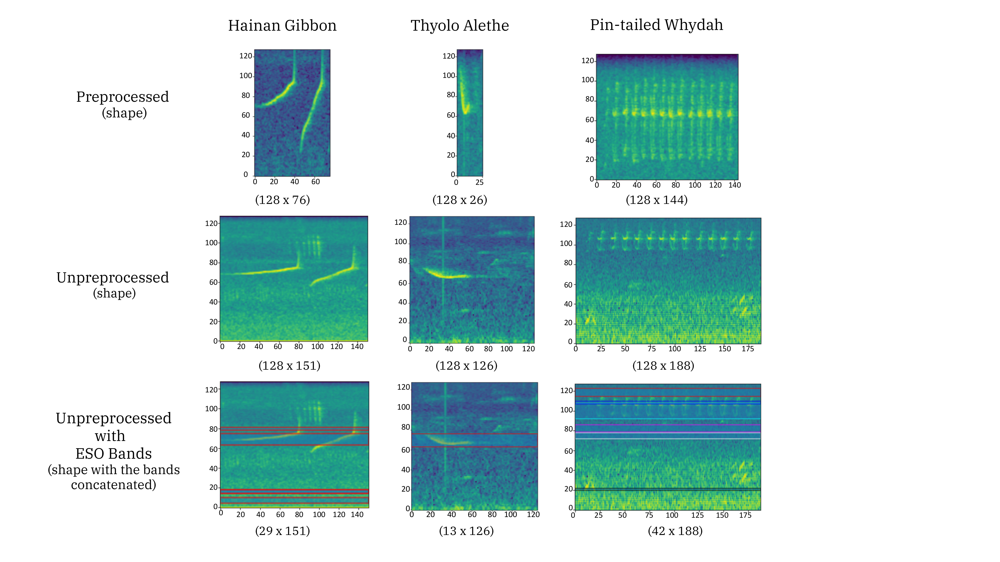

# Evaluation

The final ESO chromosome is compared to the baseline on the held-out test set. The evaluation runs each model over full audio files with a sliding window, reconstructs calling bouts from consecutive positive predictions, and reports classification, computational, and energy metrics.

## Sliding-window inference

For each test file, a window is moved from start to end with the species' segment duration and a one-second overlap. The baseline applies the low-pass filter and downsampling at this stage. The ESO chromosome operates on unprocessed mel-spectrograms and extracts the bands defined by its genes.

The CNN produces a probability for the presence and absence classes per window. A window is classified as positive only if the presence probability exceeds 0.8. This threshold is held constant across datasets in the paper to isolate the effect of ESO. It is application-specific and may be tuned for a given deployment.

## Calling-bout reconstruction

Consecutive positive windows are grouped into one calling bout. A bout is retained only if at least three consecutive windows are positive. Isolated positive windows are discarded. The Thyolo Alethe dataset is an exception. Its segment duration is one second and every positive window is kept.

The bout's start time is the start of the first positive window in the sequence. Its end time is the end of the last positive window.

A bout is counted as a true positive if it overlaps an annotated call by more than 25 percent of the segment duration. For Thyolo Alethe this threshold is lowered to 10 percent because the species is harder to detect. False positives are bouts with no qualifying overlap. False negatives are annotated calls with no overlapping bout. True negatives are non-overlapping windows outside annotated calls that the model also classified as negative.

## Metrics

The reported metrics cover three families.

| Category | Metrics |
| --- | --- |
| Classification | F1, precision, recall, confusion matrix |
| Compute | Trainable parameters, FLOPs per spectrogram (via `fvcore`), inference time across the test set |
| Footprint | Peak and mean RAM (via `psutil`), CPU/GPU/RAM energy (via `CodeCarbon`) |

All comparisons are written to the run directory and streamed to TensorBoard.

## Results from the paper

The published results for the concatenated configuration are reproduced below for reference.

### Mel-spectrogram size, F1, and parameters

| Metric | Hainan gibbon | Thyolo Alethe | Pin-tailed Whydah |
| --- | --- | --- | --- |
| Baseline mel-spectrogram | 128 × 76 | 128 × 26 | 128 × 144 |
| ESO mel-spectrogram | 29 × 151 | 13 × 126 | 42 × 188 |
| Mel-spectrogram size change | −55.0 % | −50.8 % | −57.2 % |
| Number of genes | 5 | 1 | 6 |
| Baseline F1 | 90.36 | 88.45 | 74.82 |
| ESO F1 | 91.28 | 90.04 | 79.48 |
| F1 change | +1.02 % | +1.80 % | +6.23 % |
| Baseline parameters | 132 234 | 32 394 | 262 794 |
| ESO parameters | 47 754 | 9 098 | 93 834 |
| Parameter change | −63.9 % | −71.9 % | −64.3 % |
| Inference time (s) | 211 → 160 | 120 → 68 | 347 → 189 |
| FLOPs change | −62.1 % | −69.1 % | −62.9 % |
| Model size on disk (kB) | 520 → 190 | 132 → 40 | 1 000 → 372 |

### RAM and energy

| Metric | Hainan gibbon | Thyolo Alethe | Pin-tailed Whydah |
| --- | --- | --- | --- |
| Peak RAM change | −24.7 % | −44.9 % | −47.3 % |
| Mean RAM change | −10.5 % | −16.7 % | −24.5 % |
| Total energy change (Wh) | 2.70 → 2.26 | 1.64 → 1.11 | 5.12 → 2.24 |
| Total energy change (%) | −16.3 % | −32.4 % | −56.4 % |

### Selected bands

<figure markdown>
  
  <figcaption>Top row: preprocessed mel-spectrograms used for the baseline. Middle row: unprocessed mel-spectrograms used for ESO. Bottom row: bands selected by the ESO chromosome. Colours distinguish overlapping bands for the Pin-tailed Whydah. After Figure 4 in Çakır et al.</figcaption>
</figure>

The selected bands match the species' vocalisation range for the Thyolo Alethe, which uses a single broad band. The Hainan gibbon and Pin-tailed Whydah chromosomes also include bands outside the primary vocalisation range. The paper hypothesises that retaining bands outside the target range helps the classifier discriminate against other species in the soundscape, contributing to the observed reduction in false positives.

## Visualising a saved chromosome

The visualisation used in the paper is produced by [`eso.utils.logger.plot_chromosome`](../api/utils.md).

```python
from eso.utils.logger import plot_chromosome

plot_chromosome(chromosome, spectrogram, save_path="best_bands.png")
```

The function draws the selected bands on top of a representative spectrogram. It is useful on its own when inspecting a saved chromosome.
