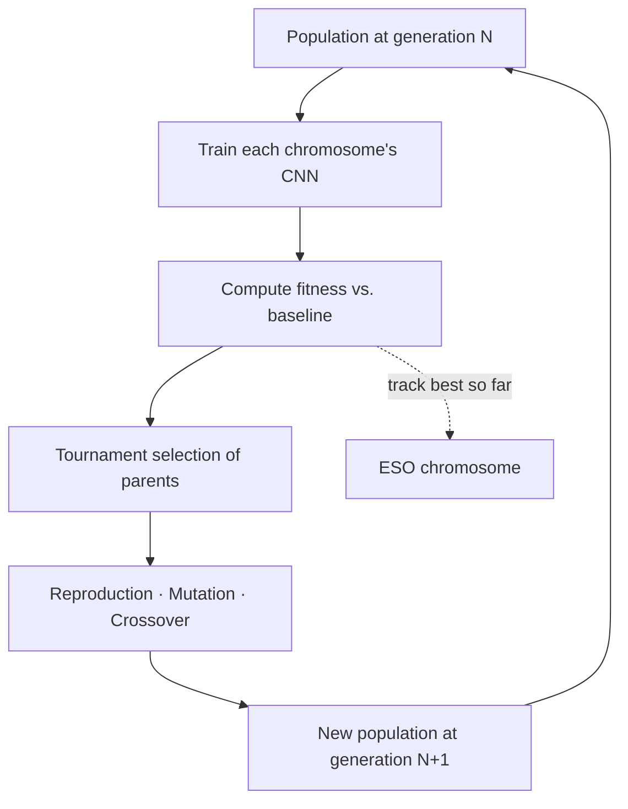
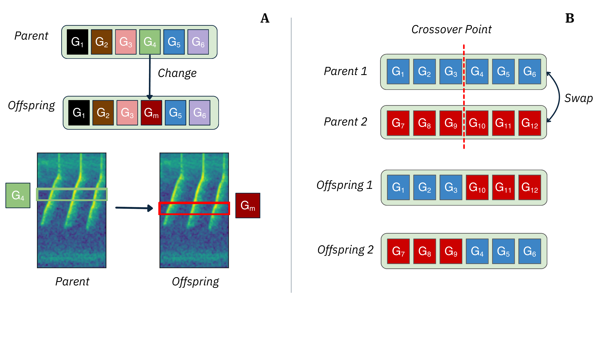

# Evolution

After the initial population is created and evaluated, ESO iterates a fixed number of generations. Each generation produces a new population through three genetic operators applied to parents selected by tournament. The previous best chromosome is preserved across generations.



## Parent selection

Selection uses tournament selection with size $t$, defined in [`SelectionOperatorConfig.tournament_size`](../configuration.md#selection_operator).

```text
1. Sample t chromosomes uniformly from the current population, with replacement.
2. Return the chromosome with the highest fitness from the sample.
```

Each call returns one parent. Operators that need two parents (crossover) call the procedure twice. Larger $t$ increases selection pressure.

## Operators

Three operators are applied with user-defined rates. The paper uses the configuration `reproduction = 0.1, mutation = 0.3, crossover = 0.6`. The default rates in [`GeneticOperatorConfig`](../configuration.md#genetic_operator) match this.

<figure markdown>
  
  <figcaption>(A) Mutation modifies the position, the height, or both of a randomly chosen gene of the parent chromosome. (B) Crossover swaps a randomly chosen range of genes between two parents. After Figure 3 in Çakır et al.</figcaption>
</figure>

### Reproduction

Asexual. One parent is selected and copied unchanged into the next generation. This preserves good solutions.

### Mutation

Asexual. One parent is selected. One gene inside that chromosome is chosen at random. Then one of three mutation types is applied uniformly at random.

| Type | Update |
| --- | --- |
| Position | $P_k' = P_k + \delta P$, subject to $0 \le P_k' + h_k \le S_h$. |
| Height | $h_k' = h_k + \delta h$, subject to $0 \le P_k + h_k' \le S_h$. |
| Both | Update both, subject to $0 \le P_k' + h_k' \le S_h$. |

The deltas are bounded by `mutation_position_range` and `mutation_height_range` in [`GeneticOperatorConfig`](../configuration.md#genetic_operator). Gene-level constraints from [`GeneConfig`](../configuration.md#gene) are respected. Fixed dimensions are not mutated.

### Crossover

Sexual. Two parents are selected. Let $l = \min(|\text{Parent}_1|, |\text{Parent}_2|)$ be the shorter chromosome length. A start index in $[0, l-1]$ and an end index in $[\text{start}+1, l]$ are drawn uniformly. Genes between the start and end indices are swapped between the two parents. Two offspring are returned.

If the parents have different numbers of genes, the crossover range is limited to the length of the shorter chromosome. Genes outside the range are inherited from each respective parent.

## Termination

The loop terminates when `algorithm.max_generations` generations have been completed. There is no early stopping in the current implementation.

After termination, the best chromosome across all generations is returned. It is the chromosome with the highest fitness value seen at any point during the run, not necessarily the best chromosome of the final generation.

## Hyperparameters that matter

| Parameter | Field | Effect |
| --- | --- | --- |
| Generations | `algorithm.max_generations` | More generations explore more of the search space at proportionally more compute cost. The paper uses 20. |
| Population size | `population.pop_size` | Larger populations explore more per generation. The paper uses 300. |
| Tournament size | `selection_operator.tournament_size` | Selection pressure. |
| Mutation rate | `genetic_operator.mutation_rate` | Probability that mutation produces the next individual. |
| Crossover rate | `genetic_operator.crossover_rate` | Probability that crossover produces the next pair. |
| Reproduction rate | `genetic_operator.reproduction_rate` | Probability that a parent is copied unchanged. |
| Fitness weights | `chromosome.lambda_1`, `chromosome.lambda_2` | Trade-off between F1 and parameter count. |

All values are settable in the configuration. See [Configuration](../configuration.md).
