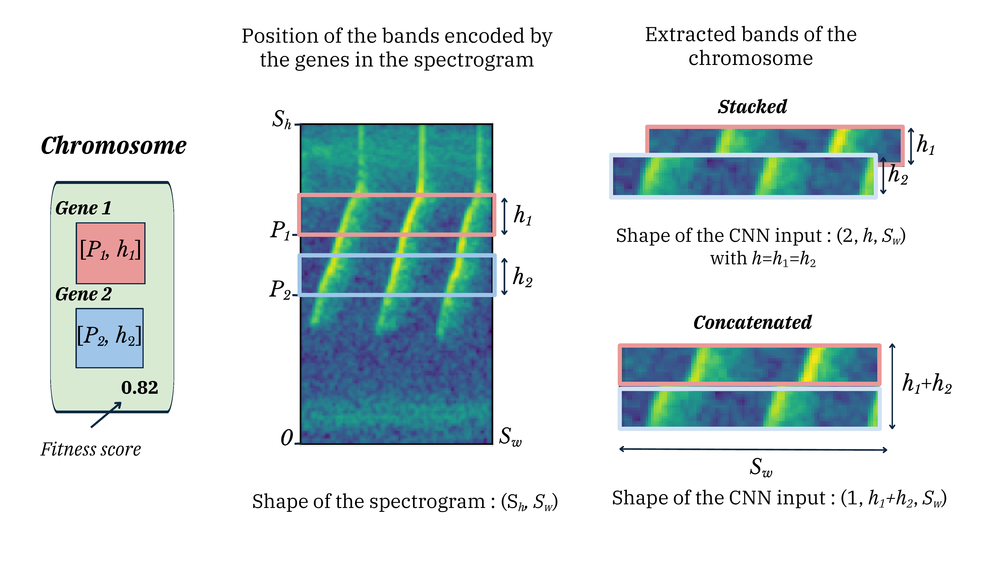

# Genes and chromosomes

## Gene

A gene encodes a single horizontal band of a mel-spectrogram. It is defined by two parameters: the lower frequency boundary $P_k$ and the height $h_k$ of the band, where $k$ indexes the gene inside its chromosome.

The position is bounded by the spectrogram height $S_h$.

\[
P_k \in [0,\; S_h - h_k], \qquad h_k \in \mathbb{N}.
\]

A gene carries no model weights. It is a pointer to a stripe of the mel-spectrogram.

<figure markdown>
  
  <figcaption>A chromosome with two genes applied to a mel-spectrogram of height $S_h$ and width $S_w$. The two genes define two frequency bands by their positions $P_k$ and heights $h_k$. The bands are extracted and either stacked or concatenated, then fed to a CNN. After Figure 2 in Çakır et al.</figcaption>
</figure>

In code:

```python
from eso.ga.gene import Gene

gene = Gene(position=42, height=10, image_shape=(128, 256))
gene.get_band_position()  # 42
gene.get_band_height()    # 10
```

### Constraints

Initialisation is constrained by [`GeneConfig`](../configuration.md#gene). The bounds determine how exploratory the search is.

| Field | Meaning |
| --- | --- |
| `min_position`, `max_position` | Bounds on $P_k$. `max_position = -1` means the spectrogram height. |
| `min_height`, `max_height` | Bounds on $h_k$. |
| `band_height` | Fix $h_k$ to a single value for every gene. Use `-1` to disable. |
| `band_position` | Fix $P_k$ to a single value for every gene. Use `-1` to disable. |

Fixing height gives the chromosome's stacked input a constant shape.

## Chromosome

A chromosome holds one or more genes. The number of genes can be fixed or sampled in a user-defined range, controlled by [`ChromosomeConfig`](../configuration.md#chromosome).

```python
from eso.ga.chromosome import Chromosome

chromo = Chromosome(genes=[...], config=chromosome_config, data=data)
chromo.train()
chromo.get_fitness()  # composite: F1 vs. baseline and parameter count vs. baseline
chromo.get_metric()   # raw F1 or accuracy
```

When the chromosome is applied to a mel-spectrogram, each gene extracts its corresponding band. The resulting image is built in one of two ways.

=== "Stacked (uniform height)"

    All genes share the same height. Bands are stacked along a new depth axis. A chromosome with $L$ genes produces an output of depth $L$.

    ```text
    spectrogram:           stacked input:
    ┌────────────────┐     ┌────┐
    │                │     │ g0 │
    │  ▓▓▓▓ g0       │     ├────┤
    │  ▓▓▓▓ g1       │ →   │ g1 │
    │       ▓▓▓▓ g2  │     ├────┤
    │                │     │ g2 │
    └────────────────┘     └────┘
    ```

    Activated by `chromosome.stack = true` in the configuration. In the paper, stacked experiments used a fixed height of 12 with up to 10 genes.

=== "Concatenated (variable height)"

    Genes can have different heights. The bands are concatenated along the frequency axis. The output has depth one. The paper allowed up to 10 genes with heights from 1 to 16 in this configuration. Results reported in the paper are from this configuration.

## Population

A [`Population`](../api/ga.md) is a set of chromosomes. The size is constant across generations. The initial population is random. Each subsequent population is produced from the previous one through reproduction, mutation, and crossover (see [Evolution](evolution.md)).

Direct access to the `Population` API is rarely needed. `ESO.run()` drives it.
