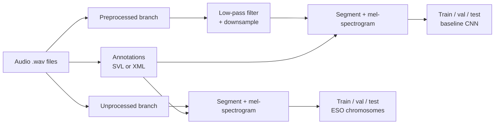

# Spectrogram preprocessing

ESO trains on two datasets per species. A preprocessed dataset, used to train the baseline CNN. An unprocessed dataset, used to train the per-chromosome CNNs and to evaluate the final ESO chromosome. Both are derived from the same audio files.

The preprocessed dataset applies a low-pass filter and downsampling. The unprocessed dataset does not. The motivation is that ESO is meant to replace these preprocessing steps with band selection.

## Annotations

[`AnnotationReader`](../api/utils.md) parses Sonic Visualiser SVL files (and equivalent XML formats) into per-event records.

The labelled events define presence segments. Absence segments are sampled from the remaining acoustic material, including biophony, geophony, and anthropophony. The paper used a 60/20/20 split for training, validation, and test, computed before preprocessing so that no audio file appears in two splits.

## Spectrograms

Mel-spectrograms are produced with a Hann window of size `n_fft` samples and a stride of `hop_length` samples, followed by a mel filter bank of `n_mels` bands.

The paper's per-species values for the two datasets are reproduced below for reference. They illustrate that ESO's unprocessed datasets retain the full available bandwidth and use the original sampling rate, while the baseline's preprocessed datasets are filtered and downsampled to twice the species' Nyquist rate.

| Field | Hainan gibbon | Thyolo Alethe | Pin-tailed Whydah |
| --- | --- | --- | --- |
| Recording rate (Hz) | 9 600 | 32 000 | 48 000 |
| Low-pass cut-off (Hz) | 2 000 | 3 100 | 9 000 |
| Downsample rate (Hz) | 4 800 | 6 400 | 18 400 |
| Segment duration (s) | 4 | 1 | 2 |
| `n_fft` | 1 024 | 1 024 | 1 024 |
| `hop_length` (preprocessed) | 256 | 256 | 256 |
| `hop_length` (unprocessed) | 256 | 256 | 512 |
| Preprocessed mel-spectrogram | 128 x 76 | 128 x 26 | 128 x 144 |
| Unprocessed mel-spectrogram | 128 x 151 | 128 x 126 | 128 x 188 |

For the Pin-tailed Whydah, the unprocessed `hop_length` is doubled to 512 to keep the spectrogram width comparable to the other datasets, given the higher original sampling rate. The same logic applies to any high-sample-rate dataset.

## Class balancing

The presence and absence training sets are typically imbalanced. The paper uses three augmentation methods to expand the minority class, all applied proportionally.

| Method | Description |
| --- | --- |
| Time shift | Pick a time point inside the segment. Shift the segment so it starts there. Wrap the tail to the beginning so the duration is preserved. |
| Blend | Pick a minority-class segment and a negative-class segment. Combine them as $\alpha x_{s1} + (1 - \alpha) x_{s2}$ with $\alpha = 0.2$. |
| Noise | Add Gaussian noise (mean 0, std 1) scaled by 0.0009. |

For the splits used in the paper, the augmented training sets contain roughly equal numbers of presence and absence segments.

## Field reference

See [`PreprocessingConfig`](../configuration.md#preprocessing) for the full list of fields and their defaults.
