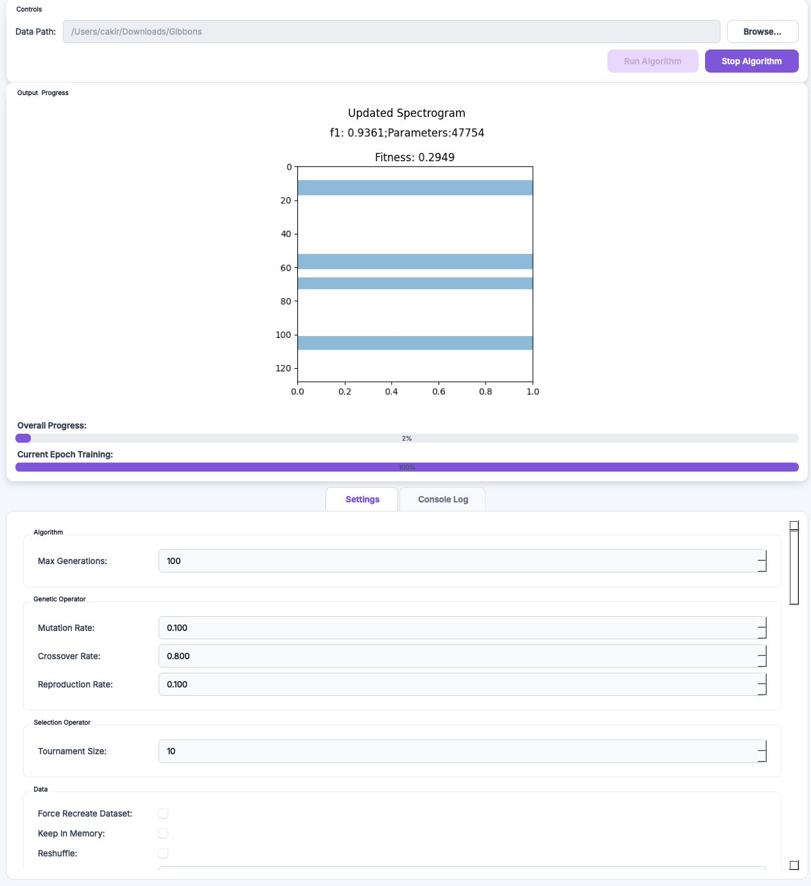

# GUI

`eso_app.py` is a PyQt5 application that wraps the full ESO pipeline. It configures settings, launches runs, and embeds a TensorBoard launcher.

<figure markdown>
  
  <figcaption>The ESO GUI. The panels follow the pipeline stages: data, algorithm, genes, chromosome, model, run.</figcaption>
</figure>

## Launch

From the repository root:

```bash
python eso_app.py
```

The GUI requires a display server. On a remote host, use X forwarding or VNC.

## Panels

The interface follows the pipeline.

- **Data.** Audio directory, annotation file type, positive and negative class names.
- **Preprocessing.** Sample rate, low-pass cut-off, downsample rate, segment duration, `n_fft`, `hop_length`, `n_mels`, frequency bounds.
- **Algorithm.** Maximum number of generations.
- **Population.** Population size.
- **Selection and operators.** Tournament size, mutation, crossover, and reproduction rates.
- **Genes.** Position and height bounds. Fixed band height. Fixed band position.
- **Chromosome.** Number of genes (fixed or range). `stack` vs. concatenate. Fitness weights $\lambda_1$ and $\lambda_2$.
- **Model and architecture.** Optimiser, loss, learning rate, batch size, epochs, metric. Convolutional and fully-connected hyperparameters.
- **Run.** Start and monitor a run. The output panel streams logs.
- **TensorBoard.** Launches a local TensorBoard server on the run directory.

Settings are written to and read from JSON. A configuration produced in the GUI runs unchanged from the Python API.

## Headless use

For CI or remote runs, skip the GUI.

```python
from eso import ESO
ESO(settings_path="settings/my_experiment.json").run()
```
