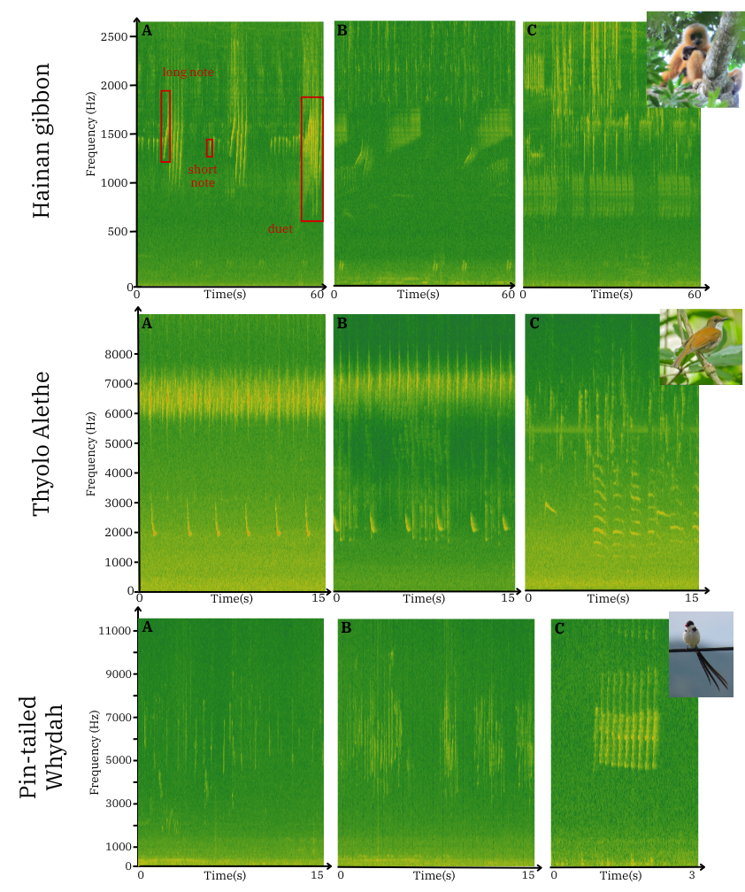

---
hide:
  - navigation
  - toc
---

  Research Software
  Jeantet · Çakır · Lontsi · Dufourq
  ·
  MIT licence

<h1 class="eso-h1-large">Evolutionary Spectrogram Optimisation</h1>

A genetic algorithm for selecting informative mel-frequency bands in passive acoustic monitoring. The selected bands form a reduced-size input to a CNN classifier whose architecture is otherwise unchanged from the baseline.

  

    Abstract
    

      
<b>Domain</b>Passive acoustic monitoring

      
<b>Targets</b>Hainan gibbon · Thyolo Alethe · Pin-tailed Whydah

      
<b>Hardware</b>Low-resource edge devices

    

  

  

Convolutional neural networks for bioacoustic classification typically operate on full mel-spectrograms produced after low-pass filtering and downsampling. The networks are large and the preprocessing pipeline is computationally expensive, limiting deployment on resource-constrained devices.

This software implements ESO, an evolutionary algorithm that reduces the size of the network's input. A genetic algorithm searches over horizontal frequency bands of the unprocessed mel-spectrogram. Bands selected by the best chromosome are stacked or concatenated and used to train a CNN whose architecture is otherwise identical to the baseline. On the three datasets reported in the accompanying paper, ESO reduces mel-spectrogram size by 51 to 57 percent, trainable parameters by 64 to 72 percent, and energy consumption by 16 to 56 percent, while improving the F1-score by 1 to 6 percent.
  

<h2 class="eso-numbered">1. Datasets</h2>

ESO was evaluated on three publicly available bioacoustic datasets that differ in target species, recording rate, soundscape complexity, and call structure.

<figure markdown>
  
  <figcaption>Representative mel-spectrograms across the three study datasets. Panels show target vocalisations and the surrounding soundscape.</figcaption>
</figure>

<h2 class="eso-numbered">2. Representation</h2>

A gene encodes a single mel-spectrogram band by its lower frequency boundary $P_k$ and height $h_k$, with $P_k \in [0, S_h - h_k]$, where $S_h$ is the mel-spectrogram height. A chromosome is an ordered collection of genes and constitutes one candidate solution.

<figure markdown>
  
  <figcaption>A chromosome with two genes applied to a mel-spectrogram of a Hainan gibbon vocalisation. Each gene defines a band by its position and height. Bands are extracted, then either stacked or concatenated.</figcaption>
</figure>

<h2 class="eso-numbered">3. Core abstractions</h2>

Five classes cover the algorithm. Each lives under `eso/ga/` or `eso/model/` and is documented in the API reference.

  

### Gene
A single horizontal band, encoded as a position and a height.
eso.ga.gene.Gene
  

  

### Chromosome
An ordered set of genes and the CNN trained on the bands they define.
eso.ga.chromosome.Chromosome
  

  

### Population
A generation of chromosomes, evaluated and evolved together.
eso.ga.population.Population
  

  

### GeneticOperator
Reproduction, mutation, and crossover with user-defined rates.
eso.ga.operator.GeneticOperator
  

  

### SelectionOperator
Tournament selection. The tournament size is the only parameter.
eso.ga.selection.SelectionOperator
  

  

### Fitness
Relative F1 gain against the baseline plus relative reduction in trainable parameters.
Chromosome.get_fitness
  

<h2 class="eso-numbered">4. Documentation</h2>

Installation, configuration, and the algorithm's details, with cross-references to the source code.

-   ### Installation

    System requirements, PyTorch wheel selection, and the editable install.

    [Read &rarr;](getting-started/installation.md)

-   ### First run

    Settings JSON template and a minimal Python API example.

    [Read &rarr;](getting-started/first-run.md)

-   ### How ESO works

    Pipeline, representation, evolution, training, and evaluation.

    [Read &rarr;](concepts/overview.md)

-   ### Configuration

    Every field of the settings JSON, with types, defaults, and recommended values from the paper.

    [Read &rarr;](configuration.md)

-   ### API reference

    Generated from docstrings in the `eso` package.

    [Read &rarr;](api/index.md)

-   ### Citation

    BibTeX and venue.

    [Read &rarr;](citation.md)

